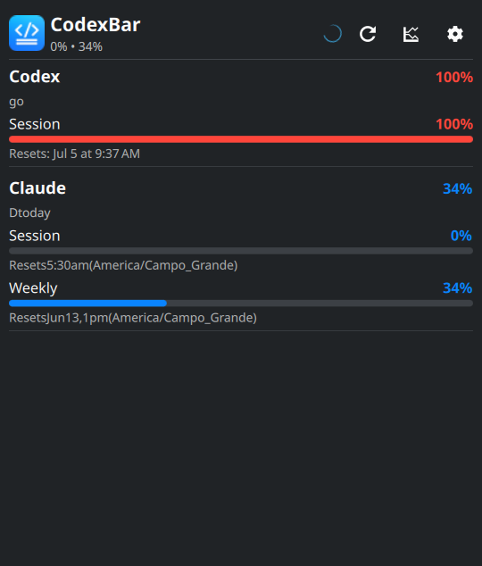
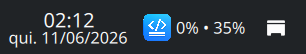
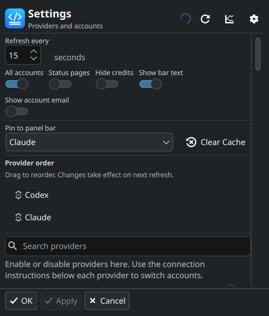
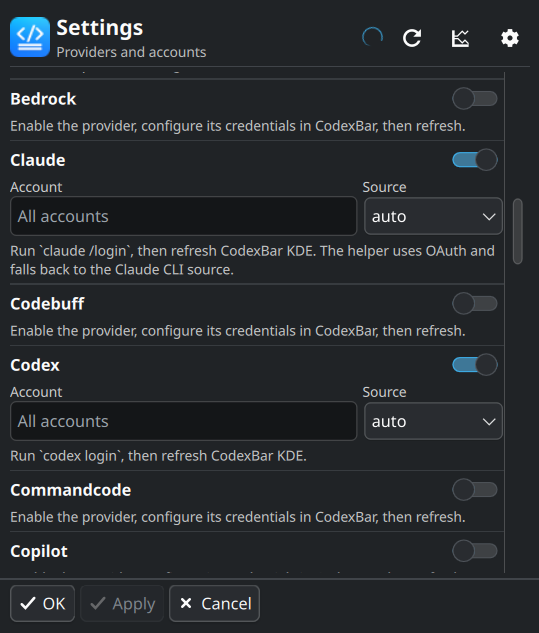

# CodexBar KDE

<p align="center">
  
</p>

KDE Plasma 6 panel widget that shows your AI provider usage limits right in the desktop bar. Powered by the [CodexBar](https://github.com/steipete/CodexBar) CLI.

<p align="center">
  <a href="https://github.com/prodesert22/codexbar-kde/actions/workflows/ci.yml">
    
  </a>
</p>

---

## Install

**Prerequisites:** `python3`, `kpackagetool6`, `plasma5support`, and the CodexBar CLI.

```bash
# AUR (Arch)
yay -S codexbar-cli

# Manual download
curl -fL "https://github.com/steipete/CodexBar/releases/latest/download/CodexBarCLI-latest-linux-x86_64.tar.gz" | tar -xz
install -m 0755 CodexBarCLI ~/.local/bin/codexbar
```

Sign in to your providers:

```bash
codex login
claude /login
```

Then install the widget:

```bash
git clone https://github.com/pedro/CodexBarKDE.git
cd CodexBarKDE
./install.sh
```

Right-click your Plasma panel → **Add Widgets** → search **CodexBar KDE** → drag to panel.

---

## Features



Icon in the panel bar with usage percentage. Click for a popup with usage bars, account identity, cost data, and provider status.

| Feature                                          | Where                          |
| ------------------------------------------------ | ------------------------------ |
| Usage bars (session / weekly / monthly)          | Popup                          |
| Account identity (email, plan)                   | Popup, per provider            |
| Cost data ($ spent)                              | Popup — click the chart button |
| Provider status (operational / degraded)         | Popup — green/yellow/red dot   |
| Enable/disable providers                         | Settings gear                  |
| Per-provider source override (oauth / cli / api) | Settings per provider          |
| Account selection (specific label/email)         | Settings per provider          |
| Refresh interval configurable                    | Settings                       |
| Pin a provider to the panel bar                  | Settings                       |
| Show/hide bar text                               | Settings                       |
| Show/hide account email (keeps plan visible)     | Settings                       |
| Clear cache                                      | Settings                       |
| Drag-to-reorder providers                        | Settings                       |

Full details: [docs/configuration.md](docs/configuration.md)

 

---

## Accounts

To switch the active account, use your provider's login command (`codex login`, `claude /login`). The widget displays whatever account the CLI returns.

You can filter to a single account per provider in **Settings → Account** field.

---

## Debugging

```bash
# Test the CLI directly
codexbar usage --provider codex --format json

# Run the widget helper
python3 package/contents/code/codexbar_kde.py summary
python3 package/contents/code/codexbar_kde.py settings
python3 package/contents/code/codexbar_kde.py state

# Run tests (pytest -n auto in parallel; falls back to unittest)
./scripts/test.sh

# Parallel runs need the dev deps once:
pip install -r requirements-dev.txt
```

Tests also run in CI on every push/PR — see [docs/development.md](docs/development.md).

Errors in the widget show "An error occurred." with a copyable traceback.

---

## Troubleshooting

| Problem              | Fix                                                                  |
| -------------------- | -------------------------------------------------------------------- |
| Widget shows `⚠`     | `codexbar usage --format json` — check CLI output                    |
| `codexbar` not found | Install via AUR or set `CODEXBAR_BIN=/path/to/codexbar`              |
| Claude errors        | Clear `source:claude` in Settings, re-login with `claude /login`     |
| Wrong account        | `codex login` to switch, then refresh                                |
| Old values           | Clear cache in Settings, or delete `~/.cache/codexbar-kde/last.json` |

More: [docs/configuration.md](docs/configuration.md#troubleshooting)

---

## Docs

- [Configuration](docs/configuration.md) — settings, state file, env vars, troubleshooting
- [Development](docs/development.md) — tests, project layout, helper commands

---

## License

MIT — see [LICENSE](LICENSE).

## Credits

| Project                                                            | Author            | Role                                                               |
| ------------------------------------------------------------------ | ----------------- | ------------------------------------------------------------------ |
| [CodexBar](https://github.com/steipete/CodexBar)                   | Peter Steinberger | CLI, provider integrations, icon                                   |
| [codexbar-waybar](https://github.com/Marouan-chak/codexbar-waybar) | Marouan Chakran   | Reference implementation (cache, source overrides, panel patterns) |
